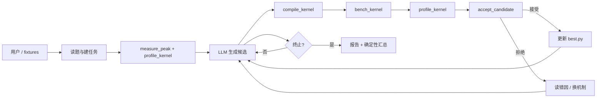

# 第16章 算子优化 Agent 设计

## 本章目标、前置知识与产物

本章把第 14 章的循环骨架和第 15 章的权威工具，组装成一个完整的**算子优化 Agent**。流程不是写死的流水线，而是由 LLM 多轮驱动；真假仍由工具锁死。

学完本章，你应该能够：

- 画出「读题 → 生成 → compile → bench → profile → accept → 反思」的循环；
- 指出每一步在源码中的落点；
- 解释为什么晋升必须有配对证据，而不是模型自评。

对应代码：

```text
code/part3-agent/
├── kernel_optimize/
│   ├── agent.py       # ReAct 主循环
│   ├── tools.py       # 三件套 + accept_candidate
│   ├── intake.py      # 从原始 kernel 建 task
│   ├── measure.py     # 峰值 + profile 载荷
│   ├── prompts.py     # SYSTEM_SOP
│   └── __main__.py    # 对话式 / --batch
├── skills/rocm-kernel-optimize/
└── chapter15/fixtures/   # 第 17 章实战入口
```

## 16.1 Agent 的整体架构

最简循环六步：

```text
读题 → 生成 → compile_kernel → bench_kernel → profile_kernel → accept_candidate
         ↑                         失败也回到生成 ←──────────────┘
```



| 步骤 | 输入 | 输出 |
|---|---|---|
| 读题 | task.json / fixtures | 可检查的合同理解 |
| 生成 | 合同 + best + 反馈 | 新候选源码 |
| compile | 源码 | `{ok, stage, errors}` |
| bench | 源码 | median/p95/带宽/算力 |
| profile | 源码 | bottleneck / AI / bound |
| accept | 源码 + change | accepted + 轨迹行 |

设计原则：

1. **工具结果就是事实**——LLM 不自报加速比；
2. **确定性代码掌权，LLM 受控提议**；
3. **分步三件套**；**唯一晋升入口** `accept_candidate`。

## 16.2 读题与问题理解

1. **对话式 intake**（`python -m kernel_optimize`）  
   `ask_user` 收集 kernel / shape / dtype → `get_environment` → 必要时 `convert_kernel` → `setup_task`。

2. **非交互 batch**（第 17 章主路径）  
   预置 fixtures，跳过提问，直接优化。

读题后要做两件事：

1. 把规格变成可检查条件（reference、atol/rtol、入口签名）；
2. 把性能目标量化（相对 baseline 的改进阈值，或绝对延迟）。

合同字段：入口签名、`shape`、`tensors` / `launchArguments`、正确性容差、benchmark 参数、`optimization.minImprovementFraction`。

## 16.3 生成初始 kernel

第一版目标只有一个：**正确**。它不追求快，但要成为之后所有比较的基线。

- baseline：用户粘贴，或 fixtures 里故意偏小 `block_size` 的朴素实现；
- 候选：LLM 根据 `profile_kernel` 与 `read_reference("optimization-patterns")`，一次改**一个主要机制**；
- 非 Triton：先 `convert_kernel`，再进入 compile / bench / accept。

第 16 章 `vector_add` fixtures 的 baseline 使用 `block_size=256`、未设 `num_warps`——给 Agent 留出「减 grid 启动开销 / 提高并行度」的可搜索头寸。

## 16.4 跑分与性能反馈

每一轮标准动作：

1. `compile_kernel(source)` — 不过则修源码；
2. `bench_kernel(source)` — 看 mean/median/p95/带宽/算力；
3. `profile_kernel(source)` — 首轮与换机制时必须；
4. `accept_candidate(source, change)` — 配对裁决；接受则覆盖 `best.py`；无论成败追加 `trajectory.jsonl`。

拿到数字后要分层比较：

1. 和合同目标比（是否值得继续）；
2. 和上一版 incumbent 比（提升 / 回退 / 噪声）；
3. 改进幅度小于阈值 → 视为无变化（`below_threshold`）。

辅助：`measure_peak` 给 Roofline 天花板；单独 `bench_kernel` 可摸底，但晋升仍以 `accept_candidate` 为准。

## 16.5 反思与改写

一次好的反思包含三个层次：

1. **现象**：数字是多少，对比目标差多少；
2. **原因**：profiling 说了什么——访存受限？占用不足？启动开销？
3. **行动**：下一步改什么，预期是什么。

映射到工具观察：

- 读 `compile_kernel` 的 `errors[]` → 修语法；
- 读 `accept_candidate` 的 `below_threshold` → 换方向；
- 读 `profile_kernel` 的 `bottleneck` → memory-bound 减搬运/减启动，compute-bound 减运算。

完成护栏：没进入闭环（未调用 compile/bench/accept）就输出最终文本，会被 nudge 回来。

还要会**承认方向走不通**：第 16 章 R5 把 `block_size` 推到 8192 反而大幅变慢，Agent 拒绝后回到 4096 路线——失败记录与成功同等重要。

## 16.6 迭代终止条件

| 条件 | 行为 |
|---|---|
| 模型不再调工具，且已进入过闭环 | 输出最终中文报告 |
| `max_steps` 触顶 | 返回步数上限提示，仍打印确定性汇总 |
| patience / 连续无提升 | SOP 引导主动收尾 |
| 阻塞显式化 | 剩余问题不再是「优化」（环境/规格做不到） |

入口结束后打印基于 `trajectory.jsonl` 的确定性汇总——报告的账本是轨迹，不是模型口头数字。

```bash
cd code/part3-agent
uv sync && source ./activate-rocm.sh
uv run python -m kernel_optimize
uv run python -m kernel_optimize --batch chapter15/fixtures/vector_add
```

## 本章小结

- 算子优化 Agent = 短主循环 + 线上对齐三件套 + `accept_candidate` + SOP。
- 读题 → 测峰值/profiling → 生成 → compile/bench/profile → accept → 反思。
- 数字永不口算；晋升只认配对证据；终止条件要显式。

## 延伸阅读

- `code/part3-agent/REFACTOR-PLAN-v2.md`
- `code/part3-agent/skills/rocm-kernel-optimize/SKILL.md`
- 下一章：多轮实战与可视化报告

