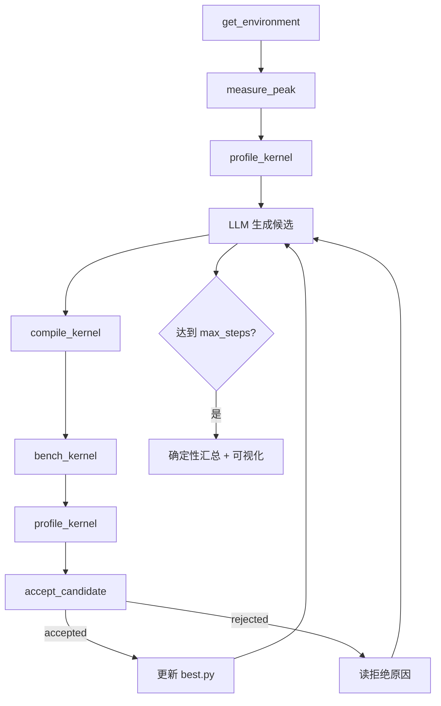

# 算子优化 Agent 实战报告 · vector_add

> 本文基于一次完整本地跑通，说明 Agent **如何优化**、**调用了哪些工具**、**提升了哪些指标**，并嵌入对应可视化图。  
> 对应教程：[第16章 设计](../chapter16/) · [第17章 实战](./index.md)

## 1. 运行概况

| 项 | 值 |
|---|---|
| 工作区 | `code/part3-agent/chapter15/logs/tasks/task-20260806-144647` |
| 入口 | `uv run python chapter16/run_part3_test.py --max-steps 12 --skip-pytest` |
| 任务 | `chapter15/fixtures/vector_add`（fp16，`4096×2048`，约 8.4M 元素） |
| LLM | 硅基流动 · `openai/Qwen/Qwen3.6-35B-A3B` |
| GPU | Radeon 8060S Graphics · `gfx1151` · ROCm 7.12 · torch `2.10.0+rocm7.12.0` |
| 退出 | `exit 0`（达到 `max_steps=12`） |
| 评估轮次 / 接受 | **10 / 5** |

核心纪律（与教程一致）：

1. **LLM 只提议**候选 kernel 与改动说明；  
2. **工具返回值才是事实**（正确性、延迟、是否接受）；  
3. 失败不覆盖 `best.py`，轨迹里照样留痕。

## 2. Agent 如何优化（闭环）



> 说明：本节数字来自 `task-20260806-144647` 历史跑次；当时工具名仍为 `evaluate_candidate` / `profile`。重构后同等闭环应调用 `compile_kernel` → `bench_kernel` → `profile_kernel` → `accept_candidate`。

对应代码主循环在 `kernel_optimize/agent.py`：每步先让 LLM `chat(..., tools=schema)`，若有 `tool_calls` 则由 `ToolExecutor` 执行，观察写回 history，再进入下一轮。

本算子是 **memory-bound** 的 element-wise add。SOP 引导 Agent 优先做「减启动开销 / 提高并行度」类改动（更大 `block_size`、调整 `num_warps`），而不是在计算侧做无意义花样。

## 3. 调用了哪些工具

### 3.1 本轮实际调用序列（历史跑次）

| Agent 步 | 工具（当时名） | 现今对应 | 关键返回 |
|---|---|---|---|
| 1 | `get_environment` | 同左 | `Radeon 8060S` / `gfx1151` / ROCm 7.12 |
| 1 | `measure_peak` | 同左 | 带宽 **210.5 GB/s**；fp16 **27.8 TFLOPS** |
| 2 | `profile` | `profile_kernel` | AI≈**0.167** → **memory-bound** |
| 3–12 | `evaluate_candidate` ×10 | `compile`+`bench`+`accept_candidate` | 5 次接受 / 5 次拒绝 |

### 3.2 当前工具职责一览

| 工具 | 类型 | 做什么 |
|---|---|---|
| `compile_kernel` | 权威 | 编译 + 正确性 → `{ok, stage, errors}` |
| `bench_kernel` | 权威 | 可信计时 → mean/median/p95/带宽/算力 |
| `profile_kernel` | 权威 | 瓶颈信号 JSON |
| `accept_candidate` | 权威晋升 | 配对裁决 + 写轨迹 + 更新 best |
| `measure_peak` | 权威 | 带宽 / TFLOPS 峰值 |

## 4. 提升了哪些指标

### 4.1 硬件与算子画像（优化前）

来自 `hardware.json` 与 `profile_kernel`：

| 指标 | 数值 | 含义 |
|---|---|---|
| 设备带宽峰值 | 210.5 GB/s | Roofline 横轴天花板 |
| fp16 峰值 | 27.8 TFLOPS | 对本算子几乎用不上 |
| 算术强度 AI | 0.167 FLOP/Byte | `flops/bytes = 8.4M / 50.3MB` |
| Bound | memory-bound | 应优先减少启动/提高访存效率 |

Baseline（故意朴素）：

```python
block_size = 256
# 未设置 num_warps / num_stages
```

由第 1 轮配对改进反推：baseline 中位延迟 ≈ **0.705 ms**。

### 4.2 最终结果（相对 baseline）

| 指标 | Baseline | Best（R9） | 变化 |
|---|---|---|---|
| 中位延迟 | ≈ 0.705 ms | **0.322 ms** | **约 2.19× 加速**（延迟降约 **54.3%**） |
| `block_size` | 256 | **4096** | grid 启动次数减少 16× |
| `num_warps` | 默认 | **32** | 提高 CU 占用与并行度 |
| 正确性 | 通过 | 通过 | 全程无「快但错」被接受 |

最终 `best.py` 要点：

```python
block_size = 4096
_vadd_kernel[grid](..., block_size, num_warps=32)
```

### 4.3 逐轮指标账本

`improvementFraction` 是相对**当时 incumbent** 的配对中位改进，不是相对最初 baseline。

| 轮 | 改动 | 延迟 (ms) | 相对 incumbent | 裁决 |
|---|---|---|---|---|
| 1 | `block_size` 256→1024 | 0.378 | **+46.34%** | ✓ 接受 |
| 2 | + `num_stages=2` | 0.372 | -0.32% | ✗ 阈值下 |
| 3 | `block_size`→2048 | 0.342 | -1.01% | ✗ |
| 4 | `block_size`→4096 | 0.338 | **+4.64%** | ✓ 接受 |
| 5 | `block_size`→8192 | 0.405 | -17.34% | ✗ 明显变慢 |
| 6 | 4096 + `num_stages=2` | 0.340 | +0.34% | ✗ &lt;1% |
| 7 | 4096 + `num_warps=8` | 0.329 | **+3.46%** | ✓ 接受 |
| 8 | `num_warps=16` | 0.326 | **+1.24%** | ✓ 接受 |
| 9 | `num_warps=32` | **0.322** | **+1.50%** | ✓ 接受（最终 best） |
| 10 | + `num_stages=2` | 0.323 | +0.50% | ✗ &lt;1% |

观察：

- **最大单轮收益**来自第一次放大 `block_size`（减 grid 启动开销），符合 memory-bound 直觉。  
- `block_size=8192` 反而大幅回退：过大 block 会伤害占用或调度，Agent 拒绝后回到 4096 路线。  
- 本机上 `num_stages` 多次试探均未过 1% 阈值；有效头寸主要在 **`block_size` + `num_warps`**。  
- 后半段收益变小，逼近噪声/带宽墙——正是教程用 vector_add 验收闭环、而不是冲 3–5× 的原因。

## 5. 可视化：优化过程

图源：同一次运行产物（已同步到本目录 `images/`）。

### 5.1 延迟与配对改进总览


解读：

- 上图绿线为 **best-so-far latency**，随接受轮次阶梯下降；  
- 下图红虚线为 **1% 接受阈值**；绿柱为接受轮，橙柱为未达阈值或变慢；  
- R5 的大负柱对应 `block_size=8192` 失败试探。

### 5.2 每轮改动时间线


时间线把「改了什么 → 延迟/Δ → 是否接受」串成一条搜索路径，便于对照 `trajectory.jsonl`。

### 5.3 状态分布


10 轮评估中：**接受 = 5**，**未达阈值 = 5**，无编译失败（与另一次含编译失败的搜索不同）。

## 6. 工具调用与指标的对应关系

| 阶段 | 工具 | 产出指标 | 如何影响后续决策 |
|---|---|---|---|
| 摸底 | `get_environment` | 设备 / arch / ROCm | 确认跑 Triton-ROCm，无需 `convert_kernel` |
| 定天花板 | `measure_peak` | 带宽、TFLOPS | 给 Roofline 横纵坐标峰值 |
| 定方向 | `profile_kernel` | AI、memory-bound | 优先试 block / warps |
| 搜索 | `compile_kernel` → `bench_kernel` → `accept_candidate` | 延迟、改进、accepted | 唯一更新 best 与轨迹的入口 |
| 收尾 | 确定性汇总 + 可视化 | 轮次、接受数、曲线 | 报告只引用工具账本，不引用模型口头数字 |

## 7. 复现方式

```bash
cd code/part3-agent
source ./activate-rocm.sh

# 需要 ~/.config/hello-gpu/kernel-agent.env
# KERNEL_AGENT_MODEL=openai/Qwen/Qwen3.6-35B-A3B
# KERNEL_AGENT_API_BASE=https://api.siliconflow.cn/v1
# KERNEL_AGENT_API_KEY=...

bash chapter16/run_and_visualize.sh --skip-pytest
# 或只对已有 workspace 出图：
# uv run python chapter16/run_part3_test.py --workspace chapter15/logs/tasks/task-XXXX --skip-agent --skip-pytest
```

产物位置：

- 轨迹 / best：`chapter15/logs/tasks/task-*/`  
- 图：`chapter15/logs/tasks/task-*/viz/` 与 `chapter16/logs/task-*/viz/`  
- 本文插图副本：`docs/part3-agent/chapter17/images/`

## 8. 小结

1. Agent 优化不是「模型口算加速比」，而是 **探测 → 定方向 → 提议 → 权威裁决 → 反思** 的闭环。  
2. 本轮历史日志工具是 `get_environment`、`measure_peak`、`profile` 与 `evaluate_candidate`；**当前代码**请用 `compile_kernel` / `bench_kernel` / `profile_kernel` / `accept_candidate`。  
3. 相对朴素 baseline，最终 best 延迟从约 **0.705 ms → 0.322 ms（≈2.19×）**；有效机制是更大 `block_size` 与更高 `num_warps`。  
4. 可视化把接受/拒绝、阈值与改动语义摊开，方便复盘搜索过程与失败回退。

