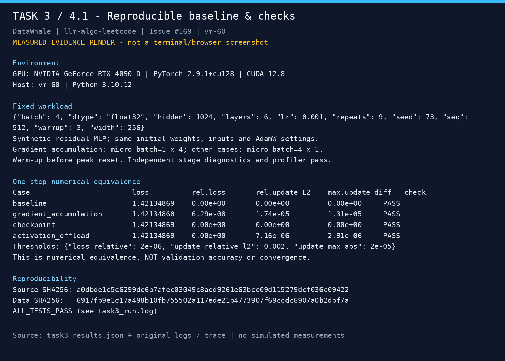
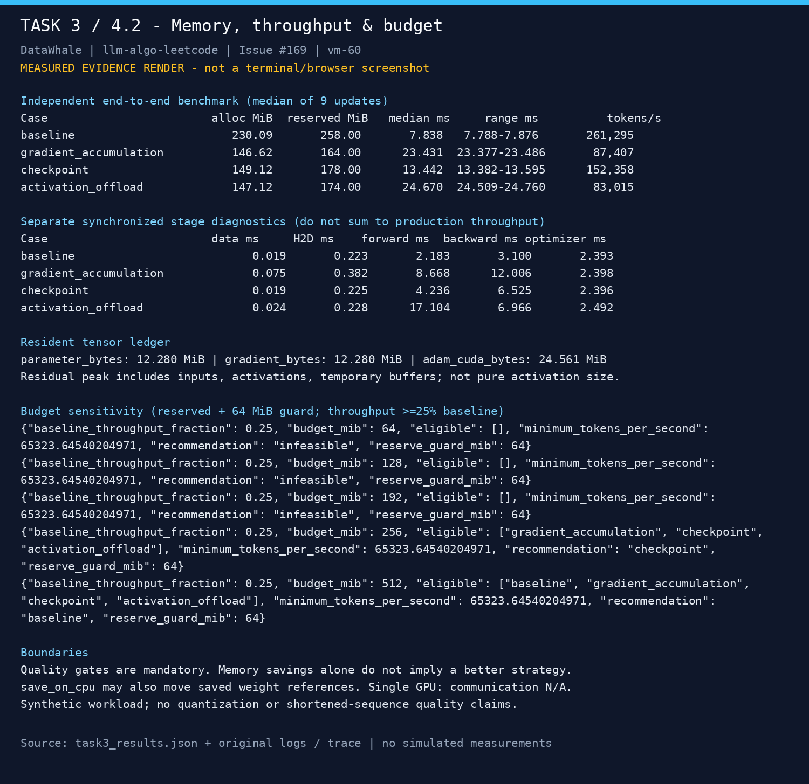
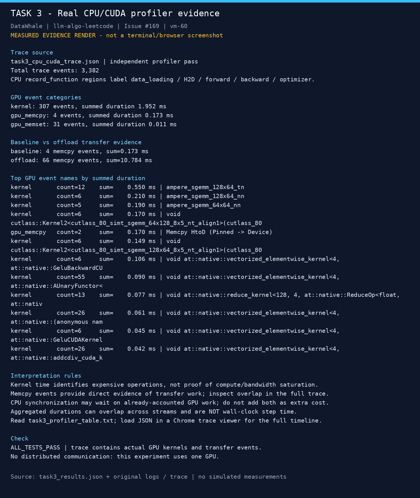

# 显存优化 Task3 打卡：训练侧测量与预算决策

微信群昵称：【自行填写】

选择：**4.1 + 4.2**。

学习社区：[DataWhale](https://www.datawhale.cn/) · 教程：[llm-algo-leetcode](https://github.com/datawhalechina/llm-algo-leetcode)。

本次在 **vm-60 / RTX 4090 D 24GB / PyTorch 2.9.1+cu128** 实测。固定 6 层残差 MLP、同初始权重与合成数据、effective batch=4、seq=512、FP32，warmup 3 次后重复 9 次。完整 step 仅边界同步，阶段诊断和 profiler 分开执行。

| 策略 | allocated 峰值 MiB | reserved 峰值 MiB | step 中位数 ms | tokens/s |
|---|---:|---:|---:|---:|
| baseline | 230.09 | 258 | 7.838 | 261,295 |
| 梯度累积 1×4 | 146.62 | 164 | 23.431 | 87,407 |
| checkpoint | 149.12 | 178 | 13.442 | 152,358 |
| saved-tensor offload | 147.12 | 174 | 24.670 | 83,015 |

我的理解与结论：

1. 看 compute、memory、transfer、scheduling 证据，不能把 GPU 利用率或总耗时当成瓶颈结论。baseline 阶段诊断中 backward 3.100 ms 最大；没有硬件带宽计数器，不能据此断言计算/带宽饱和。
2. 可复查 baseline 必须固定模型、数据、有效 batch、序列、精度与重复次数，同时记录 allocated/reserved、耗时和数值一致性。单卡 communication 不适用，合成张量切片不代表真实磁盘加载。
3. checkpoint 节省约 35.2% allocated，却让 step 慢约 71.5%。显存下降只有在预算和吞吐约束下才有意义。
4. 以 reserved + 64 MiB 余量、吞吐至少 baseline 25% 为门槛，256 MiB 预算选 checkpoint；512 MiB 预算选 baseline；64/128/192 MiB 无可行方案。预算为人为设定，未制造真实 OOM。
5. baseline 与 offload 的独立 trace 中 memcpy 分别为 4 次/0.173 ms、66 次/10.784 ms，说明卸载确实带来额外搬运。事件累计时间不等于墙钟时间。

**验证：ALL_TESTS_PASS**，四种策略均通过同初始状态的一步 loss 和参数更新一致性门槛。这不代表真实 LLM 长期收敛；量化与缩短上下文仅作理论比较。

完整笔记：【发布自己的 task03-training-measurement-budget.md 后填写可访问链接，或将笔记正文附在此评论下】

以下为真实实测 JSON/日志/trace 的排版证据图。提交时把三张 PNG 拖入 GitHub 编辑框，替换下列本地链接：

